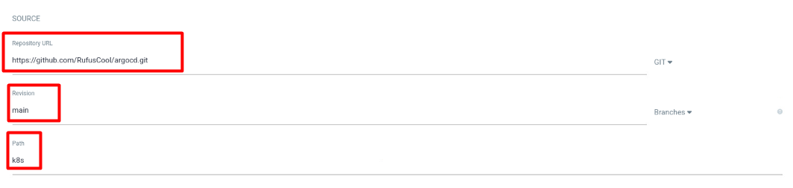
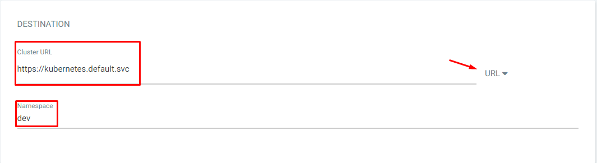
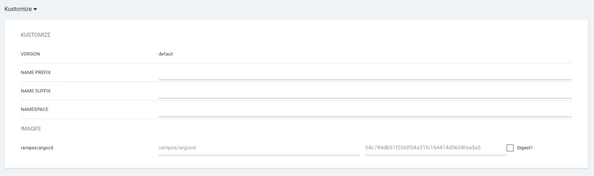
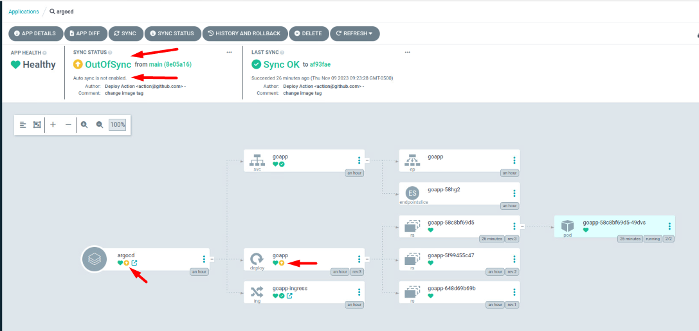
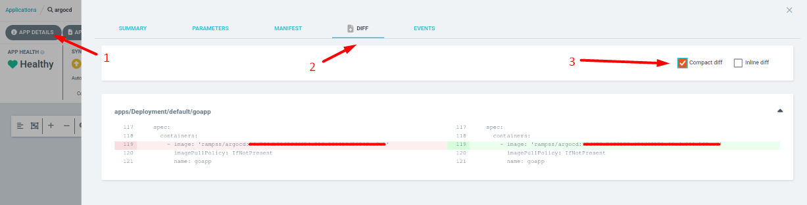
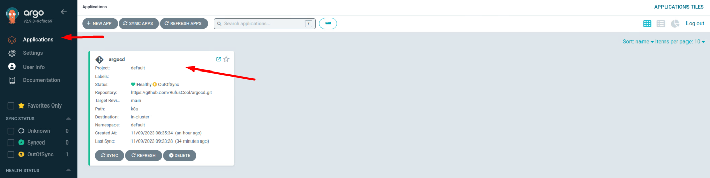
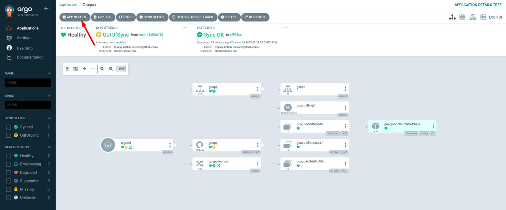
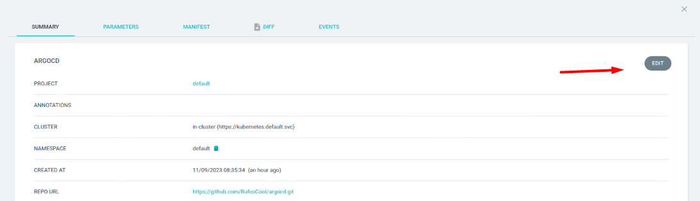
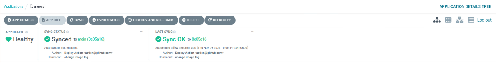

# ArgoCD


- [ArgoCD](#argocd)
  - [Passo 01 - Instalação do ArgoCD](#passo-01---instalação-do-argocd)
  - [Passo 02 - Conhecendo nossa aplicação em Go](#passo-02---conhecendo-nossa-aplicação-em-go)
  - [Passo 03 - Conhecendo nosso repositório do GitOps](#passo-03---conhecendo-nosso-repositório-do-gitops)
  - [Passo 04 - Configurando nossa primeira App no ArgoCD](#passo-04---configurando-nossa-primeira-app-no-argocd)
    - [Configurando uma nova App](#configurando-uma-nova-app)
  - [Passo 05 - Simular alterações com o `auto sync` desabilitado.](#passo-05---simular-alterações-com-o-auto-sync-desabilitado)
  - [Passo 06 - Habilitando `auto sync`](#passo-06---habilitando-auto-sync)


## Passo 01 - Instalação do ArgoCD

- Criando o namespace do ArgoCD
```
kubectl create namespace argocd
# listando os namespaces
kubectl get namespace argocd
```

- Instalando o ArgoCD
```
kubectl apply -n argocd -f https://raw.githubusercontent.com/argoproj/argo-cd/stable/manifests/install.yaml
# listando os recursos criados
kubectl get all -n argocd
```

- Criando um Ingress Resource

> Considerando que você já tem o ingress funcionando no seu cluster

```
kubectl apply -n argocd -f ingress.yaml
# listando os ingress
kubectl get ingress -n argocd
# verificando detalhes do ingress
kubectl describe ingress argocd-server-http-ingress -n argocd
# Realizar port-forward
kubectl port-forward svc/argocd-server 8080:80 -n argocd
```

- Recuperando a senha inicial

```
kubectl -n argocd get secret argocd-initial-admin-secret -o jsonpath="{.data.password}" | base64 -d
```

- Acesse via browser

https://goapp.192.168.15.43.nip.io

> Usuário padrão é `admin`

## Passo 02 - Conhecendo nossa aplicação em GO

- Repositório: https://github.com/RufusCool/argocd

## Passo 03 - Conhecendo nosso repositório do GitOps

- Repositório: https://github.com/RufusCool/argocd/tree/main/.github/workflows

## Passo 04 - Configurando nossa primeira App no ArgoCD

### Configurando uma nova App

General


> O `dev` no final do nome da aplicação já indica que iremos fazer o deploy separado por ambientes e facilita a identificação posterior dentro do argo.

Source


Destination


Kustomization


Clique em **Create**

## Passo 05 - Simular alterações com o `auto sync` desabilitado.

- Aumente o número de replicas do deployment

```
kubectl -n dev scale deployment goapp --replicas 5
```

- Veja o argo OutOfSync



- App Diff



## Passo 06 - Habilitando `auto sync`










